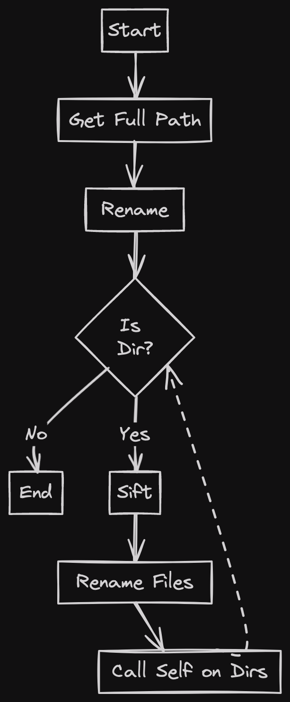

# kebab-case

Quick and dirty Go script to rename files recursively to [kebab-case](https://en.wiktionary.org/wiki/kebab_case).

 

## Authors

**Andre Silva** - [@andreswebs](https://github.com/andreswebs)

## License

This project is licensed under the [Unlicense](UNLICENSE.md).
